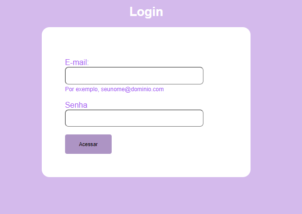

# form-login

## `Objetivo`
O projeto tem objetivo de criar uma página de login utilizando HTML e CSS contendo um campo para email, senha e o botão ACESSAR.

## `HTML`
O HTML foi reutilizado outro código de projeto já pronto [form contato](https://github.com/manuelaaraujo/form-contato), e foi editado as informações para conseguir cumprir o que foi pedido na tarefa.

## `Fontes utilizadas`
HTML e CSS

## `Resultado`
